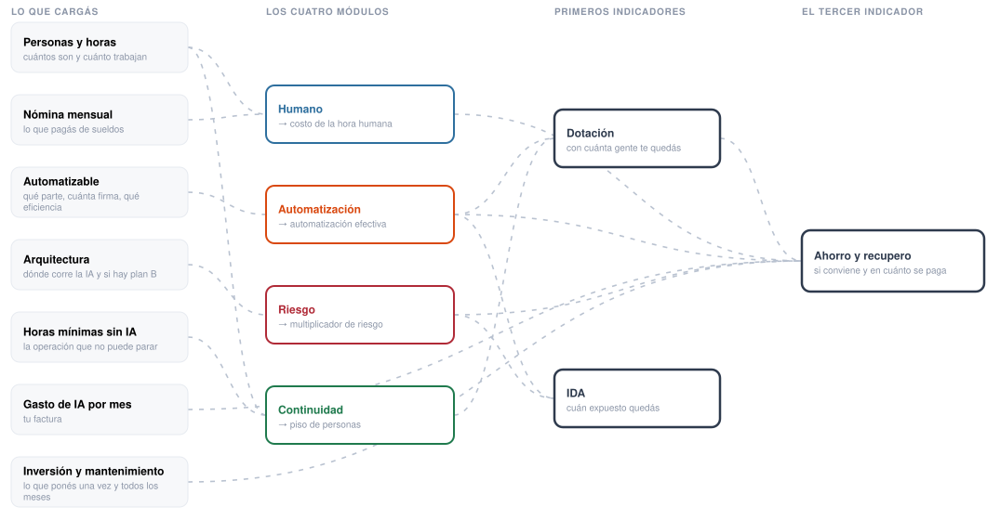
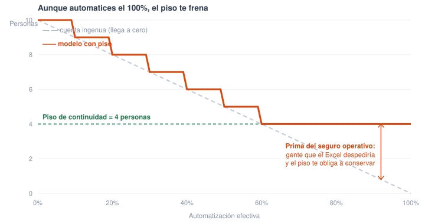
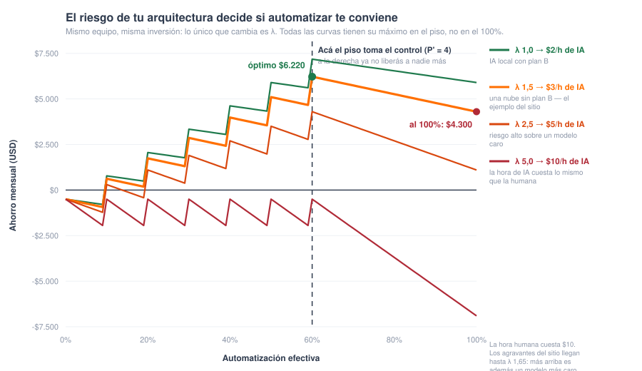
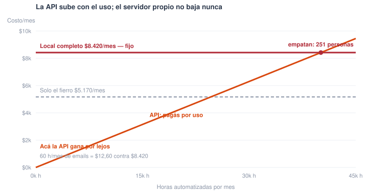
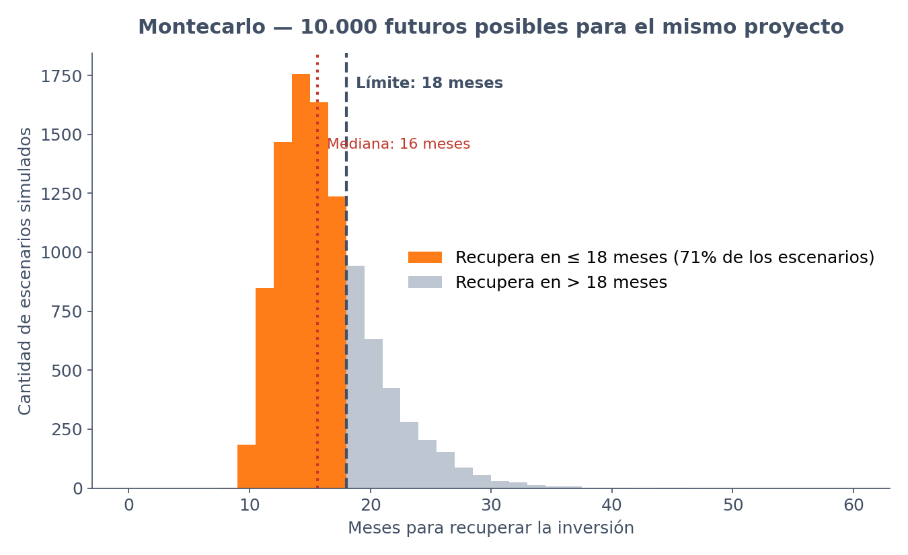

# Modelo IDA — ¿Cuánta gente necesita tu empresa el día que la IA no esté?

> Una fórmula para calcular tu **dotación mínima de continuidad** y un **Índice de Dependencia de IA (IDA)** para medir cuán expuesta está tu organización si la IA deja de estar disponible. Sirve igual para un call center, un banco, un retail o una transportadora de gas.

**[Probá la calculadora interactiva](https://modelo-ida.web.app)** · [Leer el artículo en Medium](https://medium.com/@cesarriat/modelo-ida-cu%C3%A1nta-gente-necesita-tu-empresa-el-d%C3%ADa-que-la-ia-no-est%C3%A9-7d39bab79cfd) · Autor: [César Riat](https://cesarriat.com)

---

## 1. El problema

Hoy un call center se puede automatizar al 100% con IA. Técnicamente no queda ninguna tarea que un agente no pueda hacer —leer un email, responder por voz, por WhatsApp, contestar mensajes en redes sociales—: atender, resolver, escalar, registrar. La pregunta ya no es "¿se puede?".

La pregunta es otra: **¿qué pasa si de un día para otro no podés usar IA?**

Puede pasar por muchos caminos: se cae el proveedor de nube, el modelo que usás se discontinúa, el precio cambia 10 veces, una regulación nueva te prohíbe procesar datos afuera del país, o te cortan el servicio por una disputa comercial.

Y acá está el punto ciego: cuando una empresa automatiza, calcula cuánta gente puede reducir. **Nadie calcula cuánta gente tiene que conservar.** Son dos números distintos, y el segundo es el que te salva.

Los marcos que existen hoy —las normas de continuidad de negocio como ISO 22301, la nueva ISO/IEC 42001 de gestión de IA, los análisis de impacto y los mapas de dependencia— te ayudan a *identificar* el problema. Lo que no te dan es el número: cuántas personas, cuánta inversión tiene sentido, cuán expuesto estás. Este artículo propone esa cuenta.

Y aplica a cualquier industria, aunque pega distinto según la criticidad:

| Industria | Si la IA se cae... | Severidad |
|---|---|---|
| **Call center** | Perdés ventas y clientes se enojan | Recuperable |
| **Retail** | Góndolas vacías o precios absurdos en fecha pico | Alta |
| **Banco** | Evento regulatorio, no solo comercial | Crítica |
| **Transportadora de gas** | Falla de seguridad pública, no de negocio | Extrema |

Mismo modelo, distinta severidad. Por eso la fórmula es general y los parámetros los pone cada empresa.


---

## 2. Cómo se arma la cuenta

Los datos que cargás en la calculadora pasan por **cuatro módulos**, y de ahí salen las **tres respuestas** del modelo:



Esta es una foto fija. **En el sitio es un diagrama interactivo**: hacés clic en un módulo y ves hacia dónde va, o en una respuesta y ves de qué se alimenta — [probalo acá](https://modelo-ida.web.app/diagrama).

En texto, el mismo recorrido — los cuatro módulos no son fórmulas sueltas, cada uno produce **un número intermedio**, y esos cuatro números alimentan **tres resultados**. El modelo es un embudo, no una ecuación única:

Ojo con un atajo mental frecuente: no se salta directo del % de automatización al ahorro en dólares. En el medio pasa por P' — el modelo primero decide **cuánta gente te queda de verdad**, y recién con ese número calcula la plata. Por eso hay una flecha extra en el diagrama:

```
Lo que cargás          Los cuatro módulos            Los tres resultados
─────────────          ──────────────────            ───────────────────
P, h_p, N        →     Humano        → C_h          ┐
a, r, η          →     Automatización→ a_ef         ├→   P'   ¿con cuánta gente me quedo?
ρ, C_mes         →     Riesgo        → λ            ├→   S, T ¿conviene y en cuánto se paga?
H_min, R         →     Continuidad   → P_min,       ┘→   IDA  ¿cuán expuesto quedo?
                                       cobertura
I, M             →     (entran directo en S y T)

                       ...y además:  P'  ──────────→  S
                       (solo ahorrás el sueldo de quien podés liberar)
```

---

## 3. Los cuatro módulos

### Módulo Humano
```
Costo hora humana (Ch) = Nómina mensual ÷ Horas totales
```
Ejemplo: $16.000/mes, 10 personas, 1.600 h → **$10/hora**.

### Módulo Automatización
```
Automatización efectiva = a × (1 − r) × η
```
- **r** — lo regulado (firma de médico, escribano): queda afuera sí o sí
- **a** — lo técnicamente automatizable del resto
- **η** — eficiencia real de la IA (70%–90%, nunca 100%)

Ejemplo: 0,60 × (1 − 0,20) × 0,80 = **38,4%**, no 60%. Primer baño de realidad.

**Un caso concreto: los emails de un retail.** Técnicamente se pueden contestar **el 100%** con IA: leer, entender, redactar, responder. Ese es tu `a` = 100%. Pero por regla de negocio hay correos que **tienen que pasar por una persona sí o sí**: los que mencionan temas legales, los reclamos que pueden derivar en defensa del consumidor, y los que piden datos personales. Si eso es 1 de cada 5, tu `r` = 20%. Y de los que sí automatizás, la IA no acierta siempre: hay que revisar, corregir y reenviar. Si rinde como 8 de cada 10 personas, tu `η` = 80%.

`1,00 × (1 − 0,20) × 0,80` = **64%**. Arrancaste creyendo que automatizabas todo y en la práctica sacás dos tercios de la carga. Ese 64% es el número con el que hay que hacer las cuentas.

### Módulo Riesgo
```
Costo real de la IA = λ × Gasto mensual de IA
```

Seguí con la misma pyme del ejemplo: automatizaste el 38,4% de la carga y elegiste un proveedor de IA en la nube —una sola nube, sin backup en otro proveedor— que te factura $1.229 por mes. Todavía no armaste un plan de contingencia para el día que se caiga.

Esas dos decisiones tienen precio, aunque no aparezcan en la factura. **Dónde corre la IA** — elegís *una sola* de estas tres, son excluyentes:

| Arquitectura | Recargo a λ |
|---|---|
| Una sola nube | +30% |
| Multi-cloud (2+ proveedores) | +10% |
| IA local (en tus servidores) | +2% |

**Agravantes** — se suman los que apliquen:

| Condición | Recargo a λ |
|---|---|
| Sin plan de contingencia | +20% |
| Datos sensibles en nube externa | +15% |

Tu caso: nube única (+30%) y sin plan de contingencia (+20%) → λ = 1 + 0,30 + 0,20 = **1,50**.

El costo real de tu proyecto, para decidir si conviene, no es $1.229: es 1,50 × $1.229 = **$1.844 por mes**. La factura no cambia —seguís pagando $1.229—, pero el modelo te cobra $615 extra en la evaluación: es la prima de seguro por la arquitectura frágil que elegiste. Ese costo no aparece en ninguna factura mensual — aparece entero, una sola vez, el peor día. El multiplicador lo reparte en cuotas para que una arquitectura frágil se vea cara *cuando todavía estás a tiempo de cambiarla*.

Es la lógica del seguro del auto: manejar sin seguro no sale más barato, sale igual hasta que chocás.

No hay arquitectura gratis, hay que elegir qué precio pagar. Si corrieras esa misma IA en tus propios servidores, λ bajaría mucho —menos riesgo— pero tendrías que poner la inversión inicial de armar y mantener esos servidores. Si te quedás en la nube de un solo proveedor, la inversión inicial es baja —pagás por mes, nada más— pero el riesgo es mayor porque quedás atado a ese proveedor. ¿Cuál conviene? Depende de cuánto volumen proceses: con poco volumen la nube sale más barata aunque sea más riesgosa; con mucho volumen, tu propia infraestructura empieza a compensar el riesgo que evitás. Ese es exactamente el trade-off que ves en números reales en la sección 5 (Casos extremos) y en la 7.2.

### Módulo Continuidad
```
Piso de continuidad (P_min) = Horas mínimas para operar sin IA ÷ Horas por persona
```

Ahora la pregunta incómoda: si mañana la IA se cae, ¿con cuánta gente seguís? No es cero, aunque hoy automatices el 38,4%.

Pensalo en modo degradado y calculá a ojo, no hace falta un estudio: *"¿cuántas horas por mes tengo que cubrir sí o sí, aunque no tenga IA?"*. *"Si se cae todo tengo que atender 800 llamados al mes, y una persona atiende 2 por hora"* → 400 horas. *"Y alguien tiene que revisar pedidos 8 horas por día"* → 240 horas más. Total ≈ 640 h/mes: ese es tu `H_min`.

Piso de continuidad = 640 horas ÷ 160 horas por persona = **4 personas**

Esas 4 personas son tu P_min: no importa que automatices el 100%, nunca vas a bajar de 4 en este equipo. Son las horas de la operación crítica en modo degradado —si esa IA corriera en tus propios servidores te recuperarías más rápido y este piso bajaría; si dependés de una sola nube externa, recuperarte tarda más y el piso sube.

> **Ojo: esto NO es lo mismo que la firma del médico o del escribano.** Son dos preguntas distintas y es donde más se confunde la gente.
>
> `r`, en el módulo Automatización, pregunta: *del trabajo que la IA podría hacer, ¿cuánto no puede por norma?* Es la firma del médico, del escribano, del auditor. Eso pasa **aunque la IA funcione perfecto**: hay tareas que legalmente no se delegan.
>
> `P_min`, acá, pregunta otra cosa: *si mañana la IA no está, ¿con cuánta gente sostengo lo que no puede parar?* No importa la firma: importa la **capacidad operativa**.
>
> Puede pasar que las dos cosas coincidan —el médico que firma es también el que sostiene la guardia— pero son cuentas separadas.

**Y una pregunta más: ¿hay respaldo fuera del área? → produce R**

```
cobertura = MÍNIMO( R ÷ P_min , 1 )
```

El piso `P_min` mira solo hacia adentro del área. Pero una operación de 5 personas dentro de una empresa donde otras 20 saben hacer esa misma tarea **no está tan expuesta** como un call center de 200 donde nadie más sabe. **R** es esa gente: las personas de **fuera del área** que podrían cubrir la operación crítica el día que la IA no esté.

> **El error que hay que evitar: R no es la plantilla de la empresa.** Toyota tiene unos 200.000 empleados y eso **no significa que R sea 200.000**. Si la tarea que automatizás es atender reclamos de garantía, R son las personas que **hoy, sin capacitación previa**, podrían sentarse a atender esos reclamos: quizás 30 en otras sucursales. Las otras 199.970 no cuentan, por más que estén en la nómina.
>
> La regla es simple: **si primero tenés que enseñarle, no cuenta.** R es capacidad disponible el día de la caída, no capacidad potencial.
>
> **Y es el número más fácil de inflar de todo el modelo,** porque es el único que *baja* el índice. Por eso el modelo nunca deja que el respaldo lleve el IDA a cero, y por eso este número es el primero que hay que auditar cuando alguien muestra un IDA sospechosamente bajo (ver §9.2).


---

## 4. Cómo se unen: los resultados

### Resultado 1 — Cuánta gente conservar (P')
```
P' = MÁXIMO entre:
   (a) ⌈ Personas actuales × (1 − Automatización efectiva) ⌉   ← la cuenta económica
   (b) Piso de continuidad P_min                                ← la cuenta de supervivencia
```

Con esos dos números en la mano —38,4% de automatización efectiva y un piso de 4 personas—, el modelo hace **dos cuentas distintas y se queda con la más grande**:

1. **Cuenta económica:** si automatizás el 38,4%, te sobra ese 38,4% de la gente → `10 × (1 − 0,384) = 6,16 → 7 personas` (redondeo hacia arriba: no existe 6,16 empleados).
2. **Cuenta de supervivencia:** el `P_min` que acabás de calcular en el módulo Continuidad → 4 personas.
3. **`MÁXIMO(7 , 4) = 7`.**

**¿Por qué la más grande?** Porque las dos son condiciones que tenés que cumplir *al mismo tiempo*: al menos 7 para el trabajo diario, al menos 4 para sobrevivir sin IA. Solo el mayor cumple las dos.

En este ejemplo manda la economía. Pero si automatizás al 90%, la cuenta económica da `⌈10 × 0,10⌉ = 1` y entonces `MÁXIMO(1 , 4) = 4`: **ahí el piso toma el control**. Por más que automatices el 100%, nunca bajás de 4. Esa diferencia es tu **reserva de capacidad humana**.

### Resultado 2 — Si conviene o no (S y T)
```
S = (P − P') × sueldo − λ × Gasto mensual de IA − Mantenimiento
T = Inversión ÷ S
```

Ya sabés que de tu equipo de 10 te quedan 7. Ahora la pregunta es cuánto ahorrás con eso — y acá importa el atajo que marcamos antes: fijate que S **arranca con P'**, el resultado anterior: solo ahorrás el sueldo de la gente que efectivamente podés liberar.

1. **Cuánta gente liberás de verdad:** `P − P' = 10 − 7 = 3 personas`. No son 3,84 (el 38,4% de 10): no se despiden fracciones de persona, y si el piso se activa liberás todavía menos.
2. **Ahorro en sueldos:** cada persona cuesta `N ÷ P = $1.600/mes` → `3 × $1.600 = $4.800`.
3. **Costo de la IA:** `1.600 × 0,384 × 1,5 × $2 = $1.843/mes`. Acá entra λ: la factura dice $2/h, el riesgo la convierte en $3/h.
4. **Ahorro:** `$4.800 − $1.843 − $500 = $2.457/mes`.
5. **Para qué sirve S:** es el semáforo y el divisor del recupero. Si S ≤ 0, automatizar cuesta más de lo que ahorra. Si S > 0, `T = $50.000 ÷ $2.457 = 20 meses`. Regla práctica: **arriba de 18 meses, no avances** — este proyecto, con la cuenta honesta, no pasa.

> #### La trampa que esta fórmula evita
>
> La cuenta intuitiva es `horas automatizadas × costo hora humana`: 614,4 h × $10 = **$6.144** de ahorro en sueldos. Es falso: vos no pagás horas, pagás sueldos. Automatizar 3,84 personas-equivalente cuando solo podés echar 3 **no ahorra 3,84 sueldos, ahorra 3** — o sea **$4.800**, no $6.144. Esas dos cifras son ahorro *bruto*: todavía no restamos la IA ni el mantenimiento.
>
> Cuando el piso de continuidad se activa la brecha explota. Con automatización al 100% y piso de 4, esa misma cuenta ingenua —ahora ya neta de IA y mantenimiento, para poder compararla con el resultado final— promete **$10.700/mes**; el ahorro real es **$4.300/mes**. Los $6.400 de diferencia son los cuatro sueldos que seguís pagando por continuidad mientras la IA hace ese trabajo. **Esa es la prima de seguro operativo, y el modelo ahora te la cobra.**

> #### ↓ El corolario incómodo: existe un óptimo de automatización
>
> Una vez que chocaste el piso, cada punto extra de automatización **suma factura de IA pero no libera a nadie más**. Desde ahí, automatizar más te **baja** el ahorro y te **sube** el IDA: quedás más pobre y más dependiente a la vez.
>
> | Autom. efectiva | Ahorro "ingenuo" | Ahorro real | IDA |
> |---|---|---|---|
> | 60% (óptimo) | $6.220 | **$6.220** | 90 |
> | 80% | $8.460 | $5.260 | 100 |
> | 100% | $10.700 | $4.300 | 100 |
>
> El máximo de automatización nunca es el óptimo de automatización.

**Una aclaración honesta sobre λ:** S es el *ahorro ajustado por riesgo*, no el flujo de caja contable. λ no es un cheque que le firmás a tu proveedor: es una prima de riesgo implícita que el modelo cobra para castigar arquitecturas frágiles al decidir. Tu contador va a ver un ahorro mayor (el mismo número con λ=1); tu director de riesgo va a querer ver este.

### Resultado 3 — Índice de Dependencia de IA (IDA)
```
IDA = MÍNIMO( Automatización efectiva × λ × (1 − cobertura × 0,7) × 100 , 100 )
```
Con el ahorro ya resuelto —$2.457 por mes, se paga en 20 meses— falta la otra pregunta: ¿qué tan expuesto quedaste?

`0,384 × 1,50 × (1 − 0 × 0,7) × 100 = 58` → zona amarilla. En el ejemplo no hay respaldo externo declarado (R = 0), así que el tercer factor vale 1 y no cambia nada.

**Qué hace el tercer factor y por qué nunca llega a cero.** Sin este término el índice era **ciego al recorte**: una sola persona automatizada en una empresa donde otras veinte saben hacer la tarea daba *el mismo IDA* que un call center donde nadie más sabe. Son situaciones opuestas y el índice las leía igual. Todos estos casos corren sobre una sola nube sin plan de contingencia (λ = 1,50):

| Situación | a_ef | P_min | R | Cobertura | IDA |
|---|---|---|---|---|---|
| Área de 1 persona automatizada al 100%, nadie más sabe | 100% | 1 | 0 | 0% | **100** |
| La misma área, pero 20 personas afuera saben hacerlo | 100% | 1 | 20 | 100% | **45** |
| Call center de 200, 60% automatizado, nadie más sabe | 60% | 80 | 0 | 0% | **90** |
| El mismo call center, con 40 que pueden cubrir | 60% | 80 | 40 | 50% | **59** |

**El descuento se topea en 0,7 a propósito.** Aunque tengas respaldo de sobra, la caída igual te cuesta: esa gente **abandona su propio puesto** para venir a cubrir —así que la interrupción se propaga a otra área— y hace tiempo que no hace esta tarea todos los días. El respaldo externo puede bajarte el IDA hasta un 70%, nunca hasta cero. **Nadie queda inmune por tener gente de reserva.**

El `MÍNIMO` no es decorativo: con automatización alta y arquitectura frágil el producto se pasa de 100 (el techo teórico es 165: a_ef=1 con λ máximo de 1,65 — una sola nube, sin plan de contingencia y datos sensibles afuera). Todo lo que supere 100 ya es "máxima dependencia posible", así que el índice se topea para que la escala 0–100 signifique siempre lo mismo.

| IDA | Zona | Qué significa |
|---|---|---|
| **< 30** | Resiliente | Una caída de IA es una molestia |
| **30–60** | Vigilancia | Necesitás piso calculado y simulacros manuales |
| **> 60** | Crítico | Tu operación es rehén de tu proveedor |

**Por qué el IDA no incluye la plata.** Es deliberado: ahorrar y estar expuesto son cosas distintas. Podés tener un proyecto que ahorra bien y recupera rápido —excelente negocio— y estar igual en zona amarilla de dependencia. Si metieras el dinero adentro del IDA, un ahorro grande te *taparía* el riesgo y el índice te diría que estás bien justo cuando más frágil estás. El dinero ya tiene su fórmula: es S.

Dos empresas con la misma automatización pueden tener IDA muy distinto: 38,4% con nube única (λ=1,5) → **IDA 58**; la misma con IA local (λ=1,02) → **IDA 39**. **La dependencia no es cuánto automatizaste: es cuánto automatizaste por cuán frágil es lo que te sostiene.**

### Las fórmulas en una sola línea

Reemplazando cada módulo por su definición, cada resultado queda en función directa de lo que cargás:

```
P'  = MÁXIMO( ⌈P × (1 − a(1−r)η)⌉ , ⌈H_min ÷ h_p⌉ )

S   = [ P − MÁXIMO( ⌈P × (1 − a(1−r)η)⌉ , ⌈H_min ÷ h_p⌉ ) ] × N/P
      − (1+Σρ) × C_mes
      − M

IDA = MÍNIMO( a(1−r)η × (1+Σρ) × [1 − MÍN(R ÷ ⌈H_min÷h_p⌉ , 1) × 0,7] × 100 , 100 )
```

S se lee en dos mitades: *los sueldos que dejás de pagar*, menos *lo que cuesta la IA ajustada por riesgo*, menos mantenimiento.

**¿Y una sola mega fórmula que junte los tres resultados?** No, y no por falta de ganas: vienen en unidades distintas —**personas**, **dólares por mes** y un **índice de 0 a 100**—. Sumarlos daría un número sin significado. Pero sí hay un **orden obligatorio**: `P'` se calcula primero porque **S depende de él**. Esa dependencia es lo que hace honesto al modelo — es la que le cobra a la empresa el costo de su propio piso de continuidad.

### La plata: inversión (una vez) vs costo operativo (todos los meses)

Confundir estos dos bolsillos es el error más caro que se puede cometer con el modelo.

| Inversión (I) — una sola vez | Costo operativo — todos los meses |
|---|---|
| Honorarios de proveedor o consultora | Tokens / API, o alquiler del servidor (**C_mes**) |
| **Horas de tus propios programadores** | Electricidad y conectividad |
| Integración con sistemas actuales | **SysAdmin o servicio gestionado** |
| Migración y limpieza de datos | Mantenimiento del software (**M**) |
| Licencias iniciales | Reentrenamiento al cambiar de modelo |
| **Horas de tu gente definiendo reglas y revisando salidas** | Monitoreo y auditoría de salidas |
| Hardware, *solo si lo comprás* | |

Las líneas en negrita son las que todo presupuesto olvida: **las horas internas no son gratis por ser internas**. Suelen ser el 20–30% de la inversión real. Si las contás en cero, el payback es ficción.

**Para evitar doble conteo:** si el servidor lo *alquilás*, es costo operativo y va en C_mes. Si lo *comprás*, es inversión y va en I. Nunca en los dos lados.

#### Dónde vive la inversión: en un solo lugar

La inversión **no aparece en ninguna fórmula de los módulos**. Solo en la división final `T = I ÷ S`:

| Inversión | Ahorro mensual | IDA | Recupero |
|---|---|---|---|
| $25.000 | $2.457 | 58 | 10 meses ✓ |
| $50.000 | $2.457 | 58 | 20 meses ✗ |
| $200.000 | $2.457 | 58 | 81 meses ✗ |

El ahorro no se mueve, el IDA no se mueve. Y está bien: la inversión es un gasto de una sola vez, no cambia cuánta plata te entra por mes ni cuán dependiente quedás.

> **La asimetría que importa:** un error en la **inversión** lo pagás una vez. Un error en el **costo operativo** te acompaña todos los meses para siempre. Si tenés poco tiempo para revisar supuestos, **revisá C_mes antes que I**.

#### El punto ciego: qué esconde el gasto mensual

La calculadora te pide el **gasto mensual** de IA porque es el número que conocés: sale de tu factura o de una proyección. Internamente guarda el **costo por hora automatizada**, para que si después cambiás cuánto automatizás, la factura escale sola. Sin eso el gasto quedaría plano y se perdería el hallazgo central del modelo — que pasado el piso, automatizar de más baja el ahorro.

Pero ojo con lo que ese número esconde: con **API** el gasto **sube y baja con el uso** —si automatizás menos, pagás menos—; con **servidor propio** el gasto es **fijo** y no baja aunque no lo uses. Con API el costo es una *diagonal*; con local, una *recta horizontal*. Por eso, si corrés local y automatizás menos de lo previsto, tu costo por hora se dispara sin que hayas tocado el contrato.

#### Cuánto cuesta de verdad correr local

Correr IA en tus servidores **no es solo el fierro**:

| Concepto | Costo mensual |
|---|---|
| Alquiler 2× H200, 24/7 | $5.170 |
| Electricidad (~2,1 kW constantes) | $250 |
| **SysAdmin / MLOps que lo mantenga** | **$3.000** |
| **Total real** | **$8.420** |

> **Estos números son un ejemplo, no un dogma.** La calculadora trae un **asistente de costo real**: elegís "pago por uso (API)" o "servidor propio" y te va pidiendo cada componente por separado —servidor, electricidad, sysadmin, otros—, suma el fijo mensual, lo divide por tus horas de IA y te devuelve el costo por hora listo para usar.
>
> El sysadmin puede ser **cero** con toda legitimidad: si ya tenés a alguien, si un líder técnico absorbe la tarea, o si lo contratás por hora solo cuando hace falta. Lo que el asistente busca no es imponerte un número: es que **ningún costo quede sin evaluar**. Poner 0 después de haberlo pensado es una respuesta válida; no haberlo pensado, no.

> **La ironía que hay que decir en voz alta:** ese sysadmin cuesta **1,88 veces el sueldo de la persona que estabas reemplazando** ($3.000 contra $1.600). Automatizaste para no pagar un puesto administrativo y contrataste uno técnico que sale casi el doble.

Y mueve el break-even de forma dramática:

| Qué contás | Break-even vs API DeepSeek |
|---|---|
| Solo el servidor | 154 personas-equivalente |
| Servidor + luz | 161 personas-equivalente |
| **Servidor + luz + sysadmin** | **251 personas-equivalente** |

Si no tenés esa escala, la alternativa honesta no es "no automatizar": es **API**, o un **servicio gestionado tercerizado** donde el sysadmin es problema del proveedor y entra como cuota mensual previsible.

Para el proyecto de 10 personas del ejemplo: con API DeepSeek el ahorro es **$4.168/mes** (12 meses); con servidor propio contando todo es **−$4.288/mes** y no recupera nunca. Las dos cifras usan el **mismo λ (1,02)** a propósito, para que la comparación aísle el costo y no mezcle el riesgo; si a la API le cargaras su λ real de nube única (1,50), su ahorro sería $4.106 y la conclusión no se mueve.

### Ejemplo completo
Pyme: 10 personas, $16.000 nómina, 160 h c/u (1.600 h/mes), a=60%, r=20%, η=80%, nube única sin contingencia (λ=1,5), IA $2/h, H_min 640 h, inversión $50.000, mant. $500/mes.
- Automatización efectiva: `0,60 × 0,80 × 0,80` = **38,4%**
- Dotación: `MÁXIMO(7 , 4)` = **7 personas** (el piso de 4 no se activa) → liberás **3**
- Ahorro: `3 × 1.600 − 1.843 − 500` = **$2.457/mes** → recupero **20 meses** ✗
- **IDA 58 — vigilancia.**

Este ejemplo es deliberado: con la cuenta ingenua el proyecto parecía cerrar en 13 meses y daba luz verde. Con la cuenta honesta —que solo acredita los sueldos realmente liberados— se va a 20 meses y **no pasa el filtro**. La respuesta correcta no es cancelar: es bajar λ (segundo proveedor, plan de contingencia) o bajar la inversión inicial, y volver a correr el número.


---

## 5. Aprendé los parámetros con casos extremos

Un buen modelo se reconoce en los bordes: cuando lo empujás al extremo, tiene que decir cosas sensatas. Y de paso, cada extremo te enseña una variable.

### Extremo A — "Automatizo el call center al 100%" → te enseña el piso **P_min**

La cuenta económica ingenua dice: si automatizás todo, necesitás cero personas. El modelo dice: no. La dotación cae con la automatización *hasta que choca con un piso* —el mínimo de gente para sostener la operación crítica sin IA— y ahí se planta, aunque automatices el 100%.



La diferencia entre lo que dice el Excel y lo que dice el piso es tu **prima de seguro operativo**: gente que parece "de más" hasta el martes que se cae la nube.

Y esa prima **tiene precio, no es gratis**: son sueldos que seguís pagando mientras la IA hace ese trabajo. El modelo se los cobra al proyecto en la fórmula de ahorro (ver §4), que es justamente lo que casi ningún business case de automatización hace.

### Extremo B — "Una sola nube y sin plan B" → te enseña el riesgo **λ**

Dos empresas automatizan lo mismo y pagan el mismo precio por token. Una corre todo sobre un solo proveedor, sin contingencia. La otra reparte entre dos y tiene procedimiento manual ensayado. ¿Pagan lo mismo? En la factura sí; en la realidad no. La primera "maneja sin seguro": el riesgo no aparece en la factura mensual, aparece todo junto el día del choque.

Ese riesgo se convierte en un recargo sobre el costo de la IA: el **multiplicador λ**. Si λ crece tanto que el costo real de la hora de IA alcanza al de la hora humana, la curva de ahorro se aplana. Si lo supera, **pagás por automatizar**.



Fijate que **las cuatro curvas tienen su máximo en el mismo lugar**: el 60%, donde el piso toma el control. λ no mueve el óptimo, mueve *cuánto ganás* en ese óptimo — y con la hora de IA al precio de la hora humana, la curva se hunde y automatizar te cuesta plata.

### Extremo C — "Monto DeepSeek local para automatizar los mails" → te enseña la inversión **I**

El caso que más confunde, porque mezcla dos verdades. Y acá van números reales, verificados en agosto de 2026.

**Verdad 1:** correr la IA en tus propios servidores **casi elimina el riesgo**. Nadie te corta el servicio, no dependés de ninguna nube, tus datos no salen del edificio. λ baja a casi 1. El modelo abierto de referencia hoy es **DeepSeek V4-Flash** (284B parámetros, licencia MIT): necesita ~175 GB de VRAM y entra en **2× GPUs H200**. Alquilar ese servidor 24/7 cuesta del orden de **USD 5.170 por mes**, fijo, uses lo que uses.

**Verdad 2:** ese costo es fijo y brutal si tu volumen es chico. La pregunta que la fórmula responde: **¿para qué tarea lo montás?**

Comparemos las tres opciones para automatizar emails que consumen **15 horas por semana** (~60 h/mes), asumiendo ~1 millón de tokens por hora de trabajo:

| Opción | Costo mensual para la tarea de emails | Riesgo (λ) |
|---|---|---|
| **API DeepSeek V4-Flash** ($0,14 / $0,28 por millón) | **~$12,60/mes** | Alto (nube única) |
| **API Gemini 3.6 Flash** ($1,50 / $7,50 por millón) | **~$270/mes** | Alto (nube única) |
| **DeepSeek local** (2× H200) | **~$5.170/mes** | Casi nulo |

Esos ~$12,60 salen de 60 M de tokens al mes (60 h × 1 M) repartidos mitad entrada, mitad salida. Montar el servidor local para los emails cuesta **410 veces más** que usar la API de DeepSeek. Pagás $5.170 para reemplazar $12,60 de API. Absurdo, por más que el riesgo local sea casi cero: la tarea es demasiado chica para justificar el fierro.

> **Y el fierro no es el costo completo.** Esos $5.170 son solo el alquiler. Correr IA propia necesita además **electricidad** (~$250/mes con 2,1 kW constantes) y sobre todo **alguien que la mantenga**: un sysadmin o perfil de MLOps, del orden de $3.000/mes. Total real **$8.420/mes**, y la brecha contra la API salta de 410× a **668×**.
>
> La ironía vale decirla: ese sysadmin cuesta **casi el doble** que la persona administrativa que estabas reemplazando. Automatizaste para no pagar un puesto y contrataste uno más caro.
>
> **Puede ser cero**, ojo: si ya tenés a alguien que lo absorbe o si un líder técnico se hace cargo. Lo que no es válido es no haberlo evaluado — ver §4 y el asistente de costo real de la calculadora.



**Misma tarea, tres arquitecturas, conclusiones opuestas.** Fijate también la brecha entre modelos de nube: Gemini 3.6 Flash sale ~20× más caro que DeepSeek Flash para el mismo trabajo. La fórmula no dice "local bueno / nube malo" ni "modelo caro malo": dice cuál conviene *para tu volumen y tu nivel de riesgo tolerable*.

### Extremo D — "El mismo DeepSeek local, pero a escala" → te enseña el volumen **H**

Ahora tomá el mismo servidor y ponelo en una operación que automatiza atención, back office y procesamiento a gran escala. El punto de equilibrio contra la API de DeepSeek depende de qué costos cuentes:

| Qué contás | Costo fijo/mes | Break-even | Equivale a |
|---|---|---|---|
| Solo el servidor | $5.170 | 24.600 millones de tokens/mes | 154 personas-equivalente |
| **Servidor + luz + sysadmin** | **$8.420** | **40.100 millones de tokens/mes** | **251 personas-equivalente** |

A 1M tokens por hora de trabajo, esas son 154 o 251 personas operando a tiempo completo sobre IA.

Por debajo de ese volumen, la API es más barata y sin dolores de cabeza de infraestructura. Por encima, el servidor propio empieza a ganar **y encima te baja λ al mínimo** — lo cual, para un banco, una empresa de salud o energía, puede ser decisivo aunque los números de costo estuvieran empatados: la **soberanía del dato** vuelve irrelevante el cálculo de tokens.

El mismo hardware que era un disparate para los emails es la **mejor decisión posible** a escala. No cambió la tecnología ni el precio: cambió el volumen (H) y la criticidad del dato.

> **La regla que se lleva el lector:** la IA local no se justifica por moda ni por miedo. Se justifica cuando tu volumen supera el break-even **o** cuando la criticidad del dato hace que λ importe más que el costo. Nunca antes.

> **Resumen:** el piso te frena por supervivencia, **λ** por riesgo, **I** por plata, y **H** es la palanca que puede dar vuelta cualquiera de las tres cuentas.


---

## 6. Para los más avanzados: Montecarlo

Todo lo de arriba usa números fijos: exactamente $1.229 por mes de IA, exactamente 640 horas de piso, exactamente 38,4% de automatización. Pero en la vida real esos números se mueven de mes a mes: el token cambió 10× en dos años y tu eficiencia real no la conocés hasta el tercer mes.

Montecarlo es, en el fondo, una idea simple: en vez de correr la cuenta una sola vez con el número "promedio", la **simulación de Montecarlo** la corre **10.000 veces**, moviendo un poco cada variable dentro de un rango razonable cada vez —como si probaras 10.000 futuros posibles para tu proyecto— y te quedás con el promedio de esos 10.000 resultados.



El resultado deja de ser *"recuperás en 20 meses"* y pasa a ser *"26% de probabilidad de recuperar en menos de 18 meses; mediana 22 entre los que sí recuperan"*. Los porcentajes se calculan sobre las 10.000 corridas completas — incluyendo el ~7% de escenarios donde el ahorro es negativo o el recupero pasa de 60 meses, que serían fáciles de barrer bajo la alfombra. Montecarlo no reemplaza la fórmula: la alimenta.

Ese 26% es incómodo y por eso vale la pena: dice que con estos rangos el proyecto es más una apuesta que un plan. La palanca para moverlo casi nunca es automatizar más — es bajar λ o bajar la inversión inicial.

---

## 7. Conclusiones

Tres son las que importan (7.1, 7.2 y 7.3): contraintuitivas, aparecen recién cuando hacés la cuenta honesta, y van en contra de lo que se recomienda hoy en casi cualquier presentación sobre IA. La cuarta (7.4) es cómo llevar todo esto a un canal físico —una caja, una ventanilla, una guardia—, que es donde el modelo más sirve.

### 7.1 · El máximo de automatización no es el óptimo

La intuición dice que cuanto más automatices, más ahorrás. Es falso, y el modelo muestra exactamente dónde deja de serlo.

Hay una cantidad de gente que **no podés soltar**: el piso de continuidad. Una vez que llegás a ese piso, cada punto adicional de automatización **suma factura de IA pero ya no libera a nadie más**. Seguís pagando los mismos sueldos y encima pagás más IA.

| Automatización efectiva | Promesa ingenua | Ahorro real | Recupero | IDA |
|---|---|---|---|---|
| **60% — el óptimo** | $6.220 | **$6.220** | **8 meses** | 90 |
| 80% | $8.460 | $5.260 | 10 meses | 100 |
| 100% | $10.700 | $4.300 | 12 meses | 100 |

Leé la última fila con calma: al automatizar el 100%, la cuenta ingenua promete **$10.700/mes** y la realidad da **$4.300**. Los $6.400 que faltan son los cuatro sueldos del piso, que seguís pagando mientras la IA hace ese trabajo.

> **Pasado el piso, automatizar de más te deja más pobre y más dependiente al mismo tiempo:** el ahorro baja de $6.220 a $4.300, el recupero se estira de 8 a 12 meses y el IDA sube de 90 a 100. Las tres cosas empeoran juntas — y se llega ahí haciendo exactamente lo que todos recomiendan hacer.

### 7.2 · Lo que salva un proyecto es la arquitectura, no despedir más gente

Cuando el número no cierra, el reflejo de cualquier gerente es **recortar más gente**. La conclusión anterior ya dijo que eso no funciona: no podés bajar del piso, y automatizar más te empeora las dos cosas. ¿Qué queda?

**Queda bajar λ.** Mirá el mismo proyecto —misma gente, misma automatización, misma inversión— cambiando *solamente* dónde corre la IA y si hay plan B:

| Arquitectura | λ | IDA | Ahorro | Recupero |
|---|---|---|---|---|
| Una sola nube, sin plan de contingencia | 1,50 | 58 | $2.457 | 20 meses ✗ |
| Una sola nube, con plan de contingencia | 1,30 | 50 | $2.703 | 19 meses ✗ |
| **Multi-cloud, con plan de contingencia** | **1,10** | **42** | **$2.948** | **17 meses** ✓ |
| IA local, con plan de contingencia | 1,02 | 39 | $3.047 | 16 meses ✓ |

No cambió **nada** del negocio entre la primera fila y la última. No se automatizó más, no se despidió a nadie extra, no se negoció mejor precio de tokens. Lo único que cambió es **dónde vive la IA y si hay plan B**. Con eso solo, el proyecto pasa de reprobar (20 meses) a aprobar, y el IDA cae de 58 a 39.

> **Leé la última fila con cuidado: es el piso teórico de λ, no una recomendación.** Esta tabla **aísla el efecto del riesgo**: mantiene fija la factura de IA ($1.229/mes) y mueve solo λ. Eso es exactamente lo que pasa cuando sumás un segundo proveedor o escribís el plan de contingencia — el riesgo baja y la factura casi no se mueve. Por eso la fila realista para esta empresa es **multi-cloud con plan**.
>
> Pero **mudarte a IA local no cambia solo λ: te cambia la factura entera**, de $1.229 a $8.420 por mes de costo fijo. Si esta misma empresa de 10 personas hiciera esa mudanza, su ahorro sería **−$4.288/mes** y no recuperaría nunca (§5, extremos C y D). La fila de IA local muestra hasta dónde *puede* bajar λ, no que convenga a este volumen: **local recién conviene cuando tu volumen supera el break-even**. Bajar λ es la palanca correcta; cuál de las tres opciones te sirve depende de tu escala.

> **Cuando el business case de automatización no cierra, la palanca correcta casi nunca es recortar más gente: es bajar el riesgo de la arquitectura.** Es la única decisión que mejora las tres cosas a la vez — sube el ahorro, acorta el recupero y baja la dependencia.

### 7.3 · Cuándo conviene comprar el fierro: hay dos umbrales, no uno

La conclusión anterior dice que bajes λ, y la IA local es la que más lo baja. Pero para una empresa de 10 personas el servidor propio da **−$4.288 por mes**. ¿Entonces IA local nunca sirve? No: **sirve a partir de cierta escala**, y el modelo permite calcular cuál. Lo interesante es que **no hay un umbral, hay dos**, y contestan preguntas distintas.

**Umbral 1 — Viabilidad: ¿el fierro se paga con los sueldos que liberás?** El servidor cuesta **$8.420/mes fijo** (con luz y sysadmin), uses 2 horas o 2.000. La única pregunta es cuántos sueldos liberás contra él:

| Personas que liberás | Ahorro mensual con servidor propio | |
|---|---|---|
| 3 (el ejemplo de 10 personas) | −$4.288 | ✕ pérdida |
| 5 | −$1.088 | ✕ pérdida |
| **6** | **+$512** | ✓ punto de quiebre |
| 10 | +$6.912 | ✓ |
| 20 | +$22.912 | ✓ |

**Por debajo de ~6 personas liberadas, comprar el fierro es pérdida segura**, no importa qué hagas con el resto de las variables: el costo fijo se come todo el ahorro. Por eso automatizar 2 horas de trabajo con servidor propio es un disparate y automatizar el trabajo de 20 personas es un buen negocio. La misma máquina, el mismo precio.

**Umbral 2 — Conveniencia: ¿el fierro le gana a alquilar la API?** Que el servidor deje de dar pérdida no significa que convenga: primero tiene que ganarle a alquilar. Y ese umbral **depende por completo de qué API estarías usando si no comprases**:

```
horas de IA para empatar = costo fijo mensual del fierro ÷ costo por hora de la API
```

| Si tu alternativa fuera… | Costo por hora automatizada | Local conviene a partir de |
|---|---|---|
| **API DeepSeek V4-Flash** (el más barato) | $0,21 | 40.100 h/mes = **251 personas-equivalente** |
| **API Gemini 3.6 Flash** (20× más caro) | $4,50 | 1.871 h/mes = **12 personas-equivalente** |

Mismo servidor, mismo precio, y el umbral se movió **20 veces** — de 251 personas a 12. Lo único que cambió es contra qué lo comparás. Por eso la pregunta "¿me conviene IA local?" está mal formulada si no decís *contra qué* y *a qué escala*.

> **Las tres zonas, para decidir en dos minutos.** Menos de ~6 personas liberadas: el fierro es pérdida segura, alquilá. Entre eso y el break-even de tu API: el servidor propio funciona, pero la API funciona mejor — alquilá igual, salvo que la soberanía del dato pese más que la plata. Arriba del break-even: local gana en costo *y* en λ al mismo tiempo, el único punto del modelo donde no hay que elegir entre ahorro y riesgo.

> **La frase para llevarse:** no preguntes si conviene la IA local. Preguntá **contra qué la comparás y a qué escala**: el mismo servidor es un disparate para tres personas y la mejor decisión posible para trescientas. **El costo fijo no se discute, se supera con volumen** — y el modelo te dice desde qué volumen exacto.

### 7.4 · Cómo se aplica fuera de una oficina: banco y retail

El modelo se explica con horas de oficina, pero donde más falta hace es donde hay **puestos físicos de atención**.

**Retail — cajas automáticas vs cajas con persona**

| Variable | Qué es en una caja de supermercado |
|---|---|
| **a** | % de transacciones que la caja automática procesa sola |
| **r** | Las que exigen humano sí o sí: verificación de edad (alcohol, tabaco), devoluciones, productos sin código, accesibilidad |
| **η** | El autoservicio es más lento que un cajero entrenado y genera más merma por errores y hurto |
| **λ** | Si se cae el software de punto de venta, ¿podés seguir vendiendo? |
| **P_min** | **Cuántas cajas con persona necesitás para sostener la venta en hora pico si el autoservicio no funciona** |

**Banco — cajeros automáticos y app vs ventanilla**

| Variable | Qué es en una sucursal |
|---|---|
| **a** | % de operaciones que se resuelven por cajero automático o app |
| **r** | Apertura de cuenta presencial, reclamos, efectivo sobre umbrales, atención obligatoria por accesibilidad |
| **λ** | Si se cae el core bancario o la app, ¿tenés ventanilla? Para un banco no es comercial: es un evento regulatorio |
| **P_min** | **Cuántas ventanillas humanas necesitás para no incumplir la normativa** |

En banca el modelo funciona incluso mejor, porque **r deja de ser una estimación**: no lo adivinás, lo leés de la normativa del regulador. Es el único parámetro que puede tener respaldo legal en lugar de criterio.

#### La trampa al aplicarlo: el factor de cobertura

**H_min se mide en horas de trabajo, no en puestos simultáneos.**

Si alguien dice *"necesito 3 cajas siempre abiertas"* y carga `H_min = 3 × 160 = 480 h`, el modelo devuelve **3 personas**. Está mal por más del doble: el local abre **360 horas al mes** (12 h × 30 días) pero **una persona trabaja 160**. Tres puestos cubiertos 360 horas son 1.080 horas de trabajo.

```
factor de cobertura = horas de operación del canal ÷ horas que trabaja una persona
P_min = puestos simultáneos × factor de cobertura
```

| Canal | Horas operación/mes | Factor | 3 puestos simultáneos = |
|---|---|---|---|
| Retail, 12 h × 30 días | 360 | 2,25 | **7 personas** |
| Sucursal de banco, 8 h × 22 días | 176 | 1,10 | **4 personas** |
| Guardia 24/7 (gas, energía, salud) | 720 | 4,50 | **14 personas** |

> **Tres puestos no son tres personas. En un canal 24/7 son catorce.** Ese factor de 4,5 es la razón por la que las guardias de servicios críticos parecen sobredimensionadas y no lo están: cubrir un puesto las 24 horas requiere cuatro turnos y medio de gente distinta.

Si la demanda no es pareja, calculá H_min franja por franja: `(puestos en pico × horas de pico + puestos fuera de pico × horas fuera de pico) × días`, más un margen por granularidad de turnos.

---

## 8. Qué existe afuera — y qué hueco llena esto (benchmark)

Antes de confiar en una calculadora nueva, la pregunta correcta es: **¿por qué no existía?** Alrededor de la IA hay muchísimo software de retorno, de riesgo y de cumplimiento. Lo honesto es mostrar qué hace cada categoría, qué pregunta no contesta, y dónde queda el hueco que este modelo intenta llenar.

| Qué hay hoy | Qué resuelve bien | La pregunta que no contesta |
|---|---|---|
| **Calculadoras de ROI de IA** | Cuánto ahorrás automatizando: horas por costo, payback simple. | Asumen riesgo cero y continuidad gratis. Te dicen a cuánta gente podés *bajar*; nunca cuánta tenés que *conservar*. |
| **Índices académicos de dependencia de IA** | Miden cuánto depende de la IA una economía o un sector, a nivel macro. | No bajan al gerente: no te dicen cuántas personas necesita tu área el lunes si el proveedor no responde. |
| **Normas de gestión (ISO/IEC 42001, ISO 22301)** | Te exigen plan de contingencia y evaluación de riesgos: definen el *qué*. | Son marcos, no calculadoras: piden el plan pero no dan el número — ni la dotación mínima, ni el costo del riesgo, ni el tope de inversión. |
| **Plataformas de riesgo y seguridad de IA** | Protegen el software: prompts maliciosos, fuga de datos, sesgos, cumplimiento. | Cuidan a la IA de que la ataquen. No cuidan a tu operación de quedarse *sin* IA. |

Cada pieza existe por separado. Lo que no existía es la **unión**: personas + arquitectura técnica + riesgo de negocio en una sola cuenta que se pueda auditar.

**Qué pasa hoy porque esta cuenta no se hace.** Se despide con el Excel del ROI y el piso de continuidad se descubre el día de la primera caída — como en el apagón global de CrowdStrike, cuando el "plan manual" de muchas empresas resultó no tener gente suficiente que supiera ejecutarlo. El plan de contingencia que exige la norma se escribe sin número: promete "volver a operación manual" con una dotación que ya no alcanza para operar manualmente. El directorio discute cuánto ahorra la IA, nunca cuán rehén queda del proveedor. Y la inversión se aprueba con el escenario promedio: "recuperás en 20 meses" suena a plan, hasta que lo corrés 10.000 veces y solo el 26% de los futuros recupera en menos de 18.

**Qué hace distinto este modelo.** Tres cosas: cuantifica la dotación mínima de continuidad (P') que ningún software de RRHH ni de ROI calcula; traduce la fragilidad de arquitectura a plata (λ), convirtiendo "una sola nube sin plan B" en un costo económico directo; y es preventivo y probabilístico — avisa antes de la caída, con porcentajes calculados sobre las 10.000 corridas completas, incluyendo los escenarios donde el proyecto no cierra.

**Lo que este modelo todavía no tiene.** Los coeficientes de λ salen de criterio experto e incidentes públicos, no de un dataset calibrado por sector: son un punto de partida razonable, no una verdad revelada. Y todavía no publica casos reales con métricas de antes y después. Las dos cosas están en la hoja de ruta; mientras tanto, todas las fórmulas están a la vista y podés desafiarlas con tus propios números.

---

## 9. Los límites del modelo

Ningún modelo es honesto si no dice qué *no* hace.

**1 · Supone que la gente que conservás todavía sabe hacerlo.** El piso asume que pueden ejecutar el proceso manual el día que haga falta. Si hace ocho meses que la IA hace todo y ellos solo revisan, no van a poder: son **guardia pasiva**, y la guardia pasiva se oxida. Mantener la capacidad exige **simulacros periódicos de operación manual** —como un simulacro de incendio— y eso cuesta horas que no están en ninguna fórmula. Un P_min de papel no salva a nadie.

**2 · Supone que el know-how sigue adentro.** No alcanza con tener gente disponible: tiene que quedar quién sepa **cómo se trabajaba antes**. Si en el camino se fueron los que conocían el proceso viejo, el piso existe en la planilla y no en la realidad. Documentar el proceso manual es parte del seguro.

Y **acá es donde este límite muerde más fuerte: en R, el respaldo externo.** El piso `P_min` al menos habla de gente que está en el área todos los días. R habla de gente que *supuestamente* sabe hacer la tarea pero **hace tiempo que no la hace** —o que quizás nunca la hizo en esta versión del proceso—. El modelo **no tiene forma de verificarlo**: R es una declaración, y es el único número que **baja** el riesgo en lugar de subirlo. Todos los demás castigan; este premia.

> **Cómo auditar un R antes de creerle.** Tres preguntas, y si alguna falla el número no vale:
> 1. **¿Lo hicieron alguna vez, con este proceso?** No "algo parecido en otra sucursal hace cinco años". Este proceso, esta versión.
> 2. **¿Está documentado el modo manual?** Si la única forma de aprenderlo era mirando a alguien que ya no está, R es cero por más gente que figure.
> 3. **¿Se probó alguna vez que puedan venir?** Tienen su propio trabajo. Si nadie ensayó el traspaso, no sabés cuántas horas tardan en estar operativos — y las primeras horas de una caída son las que cuentan.
>
> **Si las tres respuestas no son un sí claro, poné R = 0 y quedate con el IDA crudo.** Un respaldo declarado y no probado es el mismo papelito que un plan de contingencia que nadie ensayó: tranquiliza al directorio y no sirve el día que hace falta.

**3 · Mide costo y continuidad, no ingresos.** Para operaciones críticas eso es lo correcto: en una guardia de gas o energía no hay ingreso que justificar, hay una obligación legal de tener gente 24/7 — y el modelo sirve justamente para calcular cuánta. Pero si tu caso es comercial y automatizar genera ventas nuevas (atención 24/7, más capacidad en pico), ese ingreso **no entra acá** y hay que sumarlo por afuera.

**4 · Modela la convivencia permanente, no la degradación temporal.** La convivencia humano-IA **sí está**, y vive en **r**: si de 1.000 horas hay 200 que necesitan la firma de un abogado, un ingeniero o un arquitecto, cargás `r = 20%` y el modelo entiende que esas 200 nunca se automatizan —la IA hace el trabajo, el profesional firma—. Lo que **no** sabe representar es que la IA no se caiga del todo pero funcione peor dos semanas: más lenta, con más errores, con límite de consultas. El modelo es binario, la realidad no.

> **Cómo leer estos límites:** ninguno invalida el modelo, y los cuatro empujan en la misma dirección — **hacia arriba**. Un piso que no se entrena, un know-how que se fue y una degradación no contemplada hacen que necesites **más** gente, no menos. Si el modelo te da un número, tratalo como el **mínimo del mínimo**.

---

## 10. Cierre: la conjetura

Los bancos no eligen cuánto capital de reserva tienen: **Basilea** se los exige. Mi conjetura es que vamos hacia lo mismo con la IA: las empresas de servicios críticos van a tener que demostrar una **reserva mínima de capacidad humana** —un P_min auditado y un IDA declarado— igual que hoy declaran capital. En Europa, **DORA** ya obliga al sector financiero a gestionar el riesgo de dependencia de proveedores tecnológicos; extenderlo de "sistemas" a "personas" y de finanzas a toda industria crítica es el paso natural.

Las dos preguntas para llevarte:
1. **¿Cuál es tu piso?** ¿Con cuánta gente operás mañana sin IA?
2. **¿Cuál es tu IDA?** ¿Cuán rehén sos de tu arquitectura?

---

## Calculadora

[**Abrí la calculadora interactiva**](https://modelo-ida.web.app) para cargar los números de tu empresa y obtener tu dotación mínima, tu IDA y tu payback en tiempo real. Todo corre en tu navegador: no se envía ningún dato.

Qué trae:

- **Costo de la IA por mes** como dato de entrada, que es el número que realmente conocés (tu factura), con un asistente que lo arma componente por componente si usás API o servidor propio.
- **Diagrama de flujo interactivo** en la pestaña *Fórmulas*: hacés clic en un módulo y ves hacia dónde va, o clic en una respuesta y ves todo lo que la construye.
- **Asistente de horas mínimas** que traduce "necesito 2 puestos cubiertos" a la cantidad real de personas según el horario de tu operación.
- **Simulación de Montecarlo** con 10.000 escenarios, **comparador local vs nube** e **informe descargable en PDF** con resumen ejecutivo, análisis de ROI y gráficos.

## Licencia
MIT — usalo, adaptalo, citá la fuente. Si lo aplicás en un caso real, me encantaría saberlo.

## Autor
**César Riat** — Consultor en IA · [cesarriat.com](https://cesarriat.com)
